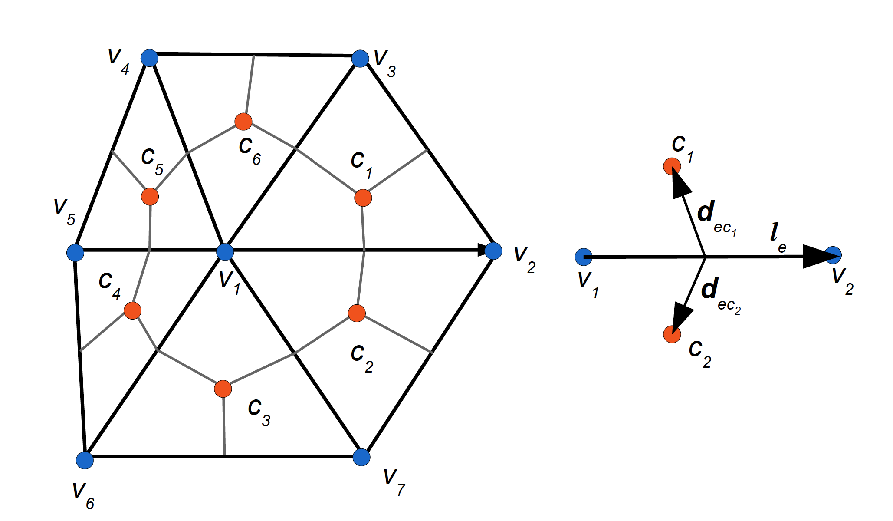

.. _testing:

testing
*******

Ocean dynamics &oce_dyn
=======================

See :cite:`Conkright2002` for an introduction to non-standard analysis. And :cite:`Colella1984` in 

.. math::
   m \frac{D\mathbf{u}}{Dt} = -mf\mathbf{k}\times\mathbf{u} +
   \mathbf{\tau}_\mathrm{air} + \mathbf{\tau}_\mathrm{ocean}
   - m \nabla{\phi(0)} + \mathbf{F}
   :label: eq_momseaice

Moving sea ice exerts a stress on the ocean which is the opposite of
the stress :math:`\mathbf{\tau}_\mathrm{ocean}` in
:eq:`eq_momseaice`.

